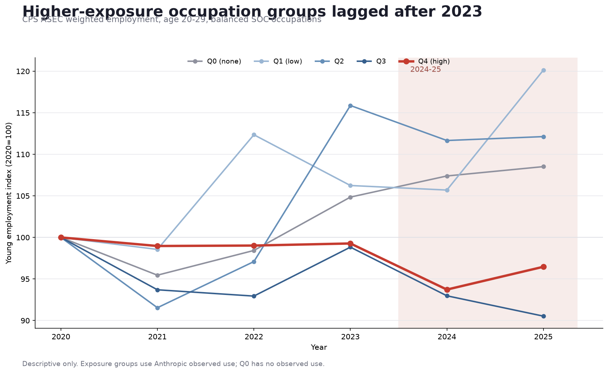
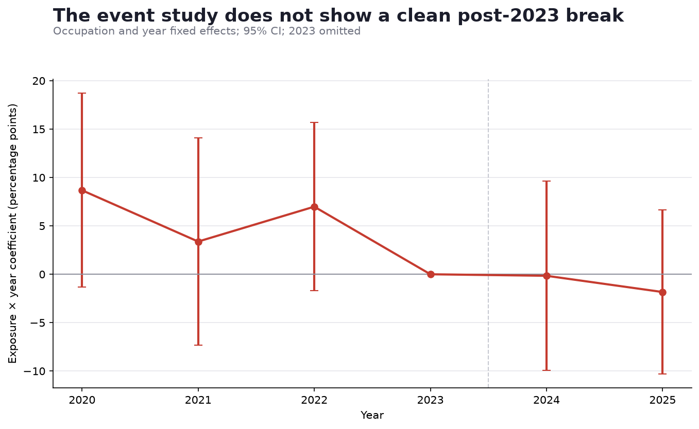
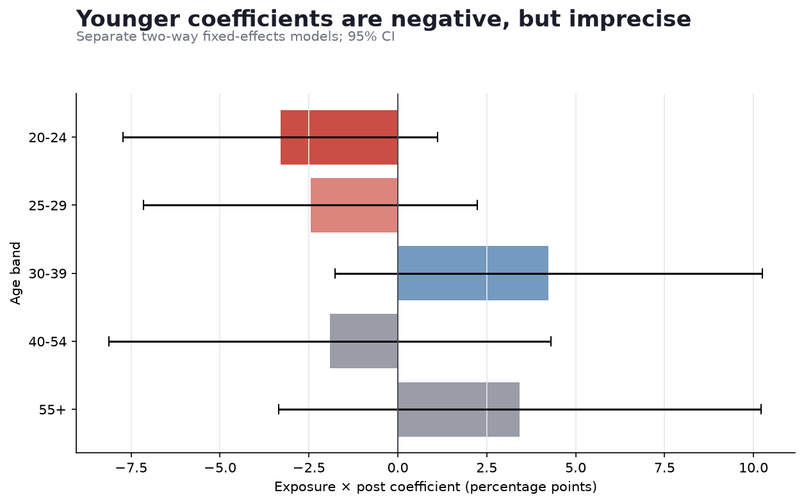

# AI Career Launch Monitor

**Are highly AI-exposed occupations becoming harder for young workers to enter
before broad unemployment rises?**

> **Finding:** Young employment in the highest-exposure occupation group fell
> after 2023 relative to its 2020 level, while zero-exposure occupations grew.
>
> **Caution:** The continuous event study does not show a clean post-2023 break,
> and the baseline estimate disappears with occupation-specific trends. This is
> an early-warning association, not a causal estimate.



## What this project measures

The project links real Anthropic Economic Index exposure data to an IPUMS CPS
occupation-by-age panel for 2020–2025. It tests two outcomes:

1. **Young-worker share:** workers age 20–29 as a share of workers age 20+ in
   each occupation.
2. **Occupational entry proxy:** workers age 20–29 in an occupation per 100,000
   employed workers age 20–29.

The second outcome uses the young labor force as the denominator. It is closer
to occupational access than the original within-occupation share, but it still
does not directly observe hiring, tenure, entry, retention, or exit.

## Main results

| Check | Estimate | What it says |
|---|---:|---|
| Young-share baseline, exposure × post-2024 | −5.76 pp (SE 2.48, p=0.020) | More-exposed occupations lost more young-worker share in the simple two-way FE model. |
| Entry proxy, exposure × post-2024 | −99.8 per 100,000 (SE 40.1, p=0.013) | Young employment shifted away from more-exposed occupations. |
| Add occupation-specific trends | +0.74 pp (SE 6.78, p=0.913) | The baseline association is not robust to occupation trends. |
| Exclude Computer & Mathematical | −6.46 pp (SE 2.63, p=0.014) | The baseline result is not only the technology hiring cycle. |
| Age 20–24 | −3.30 pp (SE 2.26, p=0.144) | Negative, but imprecise. |
| Age 25–29 | −2.46 pp (SE 2.40, p=0.305) | Negative, but imprecise. |

Coefficients use a full-unit change in observed exposure. Most occupations are
far below one. The estimates should not be read as treatment effects.

## Main design diagnostic

The event study interacts continuous exposure with each year and omits 2023.
The pre-period coefficients are not flat. The 2024 and 2025 coefficients are
negative but imprecise. This weakens a post-2023 causal interpretation.



## Robustness checks

`analysis/05_robustness.py` runs:

- age-group heterogeneity for ages 20–24, 25–29, 30–39, 40–54, and 55+;
- fake post dates in 2021, 2022, and 2023 using only pre-2024 data;
- leave-one-occupation-group-out tests for technology, business and finance,
  legal, office and administrative support, and sales;
- occupation-specific linear trends.



The younger coefficients are negative and the 30–39 and 55+ coefficients are
positive, but every age-group confidence interval crosses zero. The stronger
conclusion is that the current data are suggestive, not decisive.

## Entry-Level Squeeze Index

ELSI is a **descriptive screening index**:

```text
ELSI = scaled AI exposure
       × scaled decline in young-worker share
       × scaled baseline young-worker share
```

Only declines count. Min-max scaling and risk tiers are descriptive choices,
not estimated probabilities. New CPS builds also store unweighted person-record
counts. ELSI flags recent young-worker cells below 100 records as `low precision`.
Older panels without record counts are marked `sample unavailable`.

## Data

| Layer | Source | Status |
|---|---|---|
| Observed AI exposure | Anthropic Economic Index | Vendored, real, 756 SOC occupations |
| Occupation × age × year | IPUMS CPS ASEC | Real 2020–2025 aggregate panel, 93.3% occupation match |
| Employment and wages | BLS OEWS | Download route, not yet used in the main result |
| Entry requirements | O*NET | Download route, not yet used in the main result |

Raw IPUMS microdata and the generated CPS panel stay outside Git. The repository
contains scripts, aggregate figures, tests, and provenance. Synthetic inputs are
blocked from publication filenames and receive a visible watermark.

## Reproduce

Requires Python 3.10 or newer.

```bash
python -m venv .venv
source .venv/bin/activate
pip install -r requirements.txt

# Exposure analysis
python -m src.build_exposure
python analysis/01_exposure_descriptives.py

# Build the real CPS panel with your own IPUMS key
python -m src.occupation_crosswalk
export IPUMS_API_KEY=your_key_from_account.ipums.org
python -m src.build_cps_panel --fetch-ipums \
  --sample asec --start 2020 --end 2025

# Full research pipeline
make research
make test
```

The ASEC route uses `ASECWT` and contemporary `OCC` codes. The converter maps
2018 Census occupation codes to detailed SOC codes, records match coverage, and
rejects match rates below 80%.

## Empirical design

```text
outcome[o,t] = β(AI exposure[o] × Post[t])
               + occupation FE + year FE + error[o,t]
```

Standard errors are clustered by occupation. The repository also estimates a
continuous event study and a model with occupation-specific linear trends.

## What the current panel cannot prove

- A falling share can reflect entry, growth, retention, exit, or survey noise.
- ASEC is repeated cross-sectional data in this pipeline, not a worker-flow panel.
- Observed Claude use is not total AI exposure.
- Static exposure may proxy for earlier occupation trends.
- The modal Census-to-SOC crosswalk loses detail.
- Detailed occupation-by-age CPS cells can be noisy.

The next major data upgrade is a Basic Monthly CPS rotation panel using person
identifiers and month-in-sample. That would separate entry, retention, and exit
instead of inferring them from age composition.

## Policy relevance

If AI first weakens hiring rather than causing layoffs, some existing policies
miss the affected worker.

| Policy | Helps a laid-off worker? | Helps a never-hired graduate? |
|---|---:|---:|
| Unemployment Insurance | Yes | Usually no |
| Wage insurance | Sometimes | Limited |
| Retraining | Yes | Maybe |
| Apprenticeship subsidy | Limited | Yes |
| Hiring subsidy | Limited | Yes |
| Broad income support | Yes | Yes |

This motivates studying career-entry support, apprenticeships, and employer
incentives. The current estimates are not strong enough to select a policy.

## Repository map

```text
analysis/01_exposure_descriptives.py  Exposure distribution
analysis/02_young_workers.py          Occupation scatter
analysis/03_headline.py               Exposure-group trend
analysis/04_regressions.py            Two-way FE and event study
analysis/05_robustness.py             Trends, placebos, leave-outs, age groups
src/build_cps_panel.py                IPUMS extract and aggregation
src/build_panel.py                    Analysis outcomes
src/elsi.py                           Descriptive screening index
tests/test_pipeline.py                Pipeline tests
```

## License and citation

- Anthropic Economic Index: CC-BY 4.0
- BLS and CPS: U.S. government data; IPUMS terms apply
- O*NET: O*NET terms
- Repository code: MIT

See [`CITATION.cff`](CITATION.cff) and [`data/provenance.json`](data/provenance.json).
