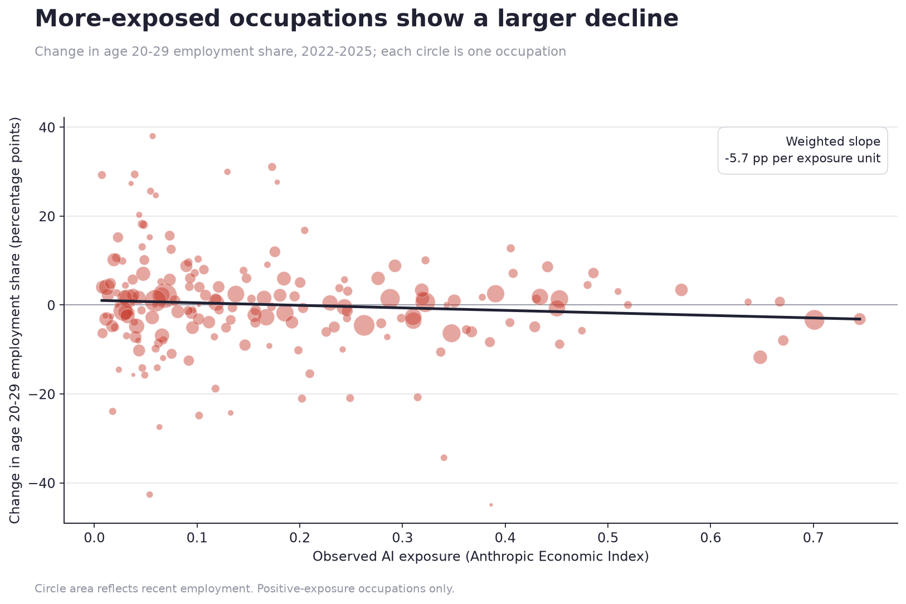

# AI Career Launch Monitor

**Is the earliest labor-market signal of AI diffusion declining entry into
exposed occupations among young workers, rather than unemployment?**

This project measures whether young workers are losing share in occupations
with high observed AI exposure. It focuses on entry-level career pathways,
wages, and the occupations that absorb new graduates.

> **Status:** The exposure analysis uses real Anthropic data. The young-worker
> pipeline has now been run on IPUMS CPS ASEC 2020–2025. CPS files stay local;
> the chart below reports aggregate results only.

## Research question

> Are highly AI-exposed occupations reducing entry-level employment before
> broader employment declines appear? If so, which workers, occupations, and
> educational pathways face the greatest risk?

This is an **early-warning design**, not a causal design. Anthropic's
[labor-market analysis](https://www.anthropic.com/research/labor-market-impacts)
finds no broad unemployment effect so far, but reports tentative evidence that
job starts among workers aged 22–25 slowed in highly exposed occupations. This
repository asks a related question about occupational entry and age composition.

## Exposure snapshot

The vendored Anthropic Economic Index file contains 756 detailed SOC occupations:

- Mean observed exposure: **0.077**
- Median observed exposure: **0.000**
- Occupations with zero observed exposure: **54.4%**
- Highest observed exposure: Computer Programmers (**0.745**), Customer Service
  Representatives (**0.701**), Data Entry Keyers (**0.671**), Medical Records
  Specialists (**0.667**), and Market Research Analysts (**0.648**)
- Highest-exposure major group: Computer & Mathematical (**0.38** mean)


These exposure facts do not show that employment has fallen.

## First CPS result

The real run produced 13,279 occupation-age-year cells. It matched 93.3% of
employed records to detailed SOC occupations and linked 364 occupations to the
Anthropic exposure data.

- Weighted descriptive slope: **-5.7 percentage points per unit of exposure**.
- Fixed-effects estimate for `exposure × post-2024`: **-0.0576**
  (SE **0.0248**, p = **0.020**, N = **2,187**).
- The event study does not show a clean 2024 break. This is an early-warning
  association, not evidence that AI caused the change.



Larger occupations flagged by ELSI include Market Research Analysts, Data Entry
Keyers, Customer Service Representatives, Graphic Designers, Computer
Programmers, and Accountants and Auditors. Small occupation cells remain noisy.

## Data status

| Layer | Source | Repository status | Used in a finding? |
|---|---|---:|---:|
| Observed AI exposure | Anthropic Economic Index | Vendored, real | Yes, descriptives only |
| Employment and wages | BLS May 2025 OEWS | Download script | Not yet |
| Occupation × age × time | CPS via IPUMS | Real ASEC 2020–2025 run; output stays local | Yes, early-warning analysis |
| Entry requirements | O*NET 30.3 | Download script | Not yet |

Raw IPUMS extracts and generated CPS panels are excluded from Git because of
size and source terms. The converter records coverage and provenance locally.

## Entry-Level Squeeze Index

The Entry-Level Squeeze Index (ELSI) flags occupations where three signals
coincide:

```text
ELSI = scaled AI exposure
       × scaled decline in age-20–29 employment share
       × scaled baseline age-20–29 employment share
```

Only declines count. Each factor is min–max scaled across matched occupations.
The final score is rescaled to 0–1 and assigned a tier: `low`, `watch`,
`elevated`, or `high`.

ELSI is a screening tool. It is not a causal estimate and its ranking can be
sensitive to the selected years, occupation crosswalk, and small CPS cells.

## Quickstart

Requires Python 3.10 or newer.

```bash
python -m venv .venv
source .venv/bin/activate
pip install -r requirements.txt

# Real exposure analysis. Runs immediately.
python -m src.build_exposure
python analysis/01_exposure_descriptives.py

# Tests
python -m unittest discover -s tests -v
```

### Build the real young-worker panel

The recommended route submits a real IPUMS CPS extract, waits for it, downloads
it to a temporary directory, validates the occupation mapping, and writes the
analysis-ready panel. A free IPUMS API key is required.

```bash
python -m src.occupation_crosswalk
export IPUMS_API_KEY=your_key_from_account.ipums.org

# Inspect the non-sensitive extract specification without a key or API call.
python -m src.build_cps_panel --dry-run \
  --sample asec --start 2020 --end 2025

# Submit ASEC 2020–2025 and build data/raw/bls/cps_panel.csv.
python -m src.build_cps_panel --fetch-ipums \
  --sample asec --start 2020 --end 2025
```

ASEC is the complete-year default and uses `ASECWT`. For a preliminary read
from released basic-monthly files, use `--sample basic`; the script queries the
published IPUMS sample catalog, skips unavailable months, averages monthly
weighted stocks, and records exact coverage and partial-year flags.

To convert a previously downloaded basic-monthly extract instead:

```bash
python -m src.occupation_crosswalk

python -m src.build_cps_panel data/raw/bls/cps_extract.csv.gz \
  --census-occ-column OCC \
  --frequency monthly
```

If your extract has a detailed SOC field, bypass the crosswalk:

```bash
python -m src.build_cps_panel data/raw/bls/cps_extract.csv.gz \
  --soc-column OCCSOC \
  --frequency monthly
```

For the repo's current 2018 Census OCC-to-SOC crosswalk, use contemporary
`OCC` from 2020 onward. Do not pass the harmonized `OCC2010` variable through
that crosswalk; earlier years require a vintage-matched crosswalk.

The converter:

- keeps employed records using `EMPSTAT ∈ {10, 12}` by default;
- applies `ASECWT` for ASEC or `WTFINL` for basic-monthly extracts;
- creates the age bands `20-24`, `25-29`, `30-39`, `40-54`, and `55+`;
- converts monthly weighted employment stocks to annual monthly averages;
- rejects occupation match rates below 80%;
- writes `cps_panel.csv` and `cps_panel.metadata.json`.

Check the variable codes against your extract's codebook. Override names,
employment codes, and the weight column through CLI options when needed.

### Run the real analysis

```bash
# 2025 is the latest complete calendar year available in August 2026.
python -m src.build_panel --baseline 2022 --recent 2025
python analysis/02_young_workers.py
python -m src.elsi
python analysis/04_regressions.py --post-from 2024 --base-year 2023
```

The panel builder blocks a partial recent year when the CPS metadata shows fewer
than 12 months. `--allow-partial-year` overrides the block, but the resulting
comparison must disclose seasonal-composition risk.

### Smoke-test without real CPS data

```bash
python tools/make_synthetic_cps.py
python -m src.build_panel --baseline 2022 --recent 2025
python analysis/02_young_workers.py --allow-synthetic
python -m src.elsi --allow-synthetic
python analysis/04_regressions.py --post-from 2024 --allow-synthetic
```

Synthetic charts and tables use `_SYNTHETIC` filenames. The analysis commands
refuse synthetic input unless `--allow-synthetic` is explicit.

## Empirical design

The baseline specification is:

```text
young_share[o,t] = β(AI_exposure[o] × Post[t]) + occupation FE + year FE + ε[o,t]
```

`young_share` is the age-20–29 share of employment among workers age 20 or
older in occupation `o` and year `t`. Standard errors are clustered by
occupation. The event study interacts exposure with each year and omits the
last pre-period year by default.

Primary diagnostics should include:

- event-study pre-trends;
- alternative age bands, including 22–25 to match Anthropic's analysis;
- employment-weighted and unweighted estimates;
- matched-month comparisons when using a partial year;
- broad occupation-group trends and leave-one-group-out estimates;
- minimum-cell and occupation-match thresholds;
- sensitivity to exposure definitions and occupation crosswalks.

## Interpretation and caveats

- **Not causal.** AI adoption has no clean onset. Post-pandemic normalization,
  interest rates, the technology hiring cycle, remote work, and education
  enrollment can all confound the estimate.
- **Composition is not hiring.** A falling young-worker share can reflect slower
  entry, faster older-worker growth, different exits, or survey measurement.
- **Exposure is incomplete.** Observed exposure measures Claude use mapped to
  occupational tasks. It is a lower bound on total AI use and can change by release.
- **Crosswalks lose detail.** A modal Census occupation-to-SOC mapping is a first
  pass. Final work should test the full many-to-many mapping.
- **Recent data can be partial.** Never compare a partial 2026 average with a
  full-year baseline without a matched-month design.
- **Small cells are noisy.** Detailed occupation-by-age CPS estimates need
  uncertainty checks, pooling, or minimum-sample rules.

## Repository layout

```text
ai-career-launch-monitor/
├── data/
│   ├── provenance.json
│   ├── raw/anthropic/job_exposure.csv
│   └── README.md
├── src/
│   ├── build_exposure.py
│   ├── build_cps_panel.py
│   ├── build_panel.py
│   ├── data_guard.py
│   ├── elsi.py
│   └── download_*.py
├── analysis/
│   ├── 01_exposure_descriptives.py
│   ├── 02_young_workers.py
│   └── 04_regressions.py
├── tests/test_pipeline.py
├── tools/make_synthetic_cps.py
└── .github/workflows/ci.yml
```

## Reproducibility

- `data/provenance.json` records the vendored file's upstream URL, license,
  row count, and SHA-256 checksum.
- `data/processed/exposure_summary.json` stores the chart's headline statistics.
- GitHub Actions runs unit tests, the real exposure build, and a clearly marked
  synthetic end-to-end smoke test on Python 3.11 and 3.12.

## Data and licenses

- [Anthropic Economic Index](https://huggingface.co/datasets/Anthropic/EconomicIndex):
  CC-BY 4.0
- [BLS OEWS](https://www.bls.gov/oes/tables.htm): U.S. government data
- [Census Basic Monthly CPS](https://www.census.gov/data/datasets/time-series/demo/cps/cps-basic.html):
  U.S. government data
- [O*NET database](https://www.onetcenter.org/database.html): O*NET terms
- Repository code: MIT

## Next research milestones

1. Add uncertainty rules and occupation-cell thresholds.
2. Add wage outcomes from OEWS and CPS.
3. Add robustness and matched-month specifications.
4. Pre-register the primary outcome, exposure measure, window, and exclusions.
5. Add policy simulations only after the descriptive estimates are stable.
