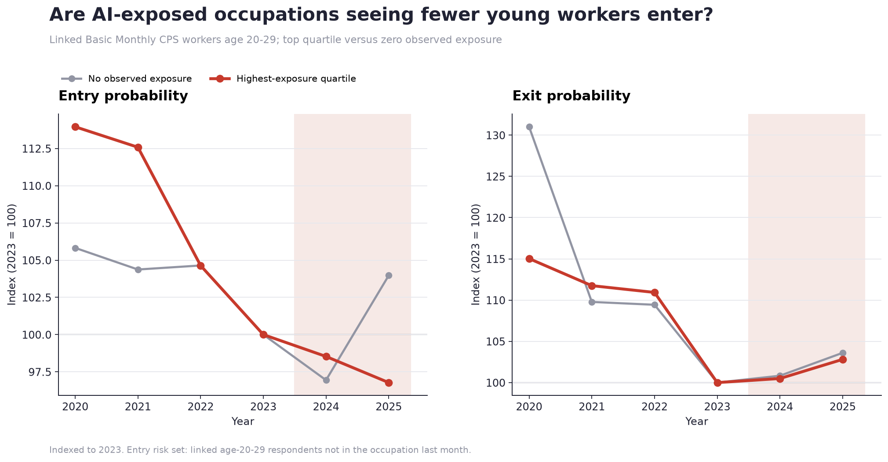

# AI Career Launch Monitor

## Question

**Are highly AI-exposed occupations seeing fewer young workers enter, rather
than more workers exit?**

**Main finding.** The corrected entry estimate is negative but imprecise. In
linked Basic Monthly CPS data for 2020–2025, observed exposure has a post-2024
entry-rate coefficient of **−0.0076 percentage points** (SE 0.0075, p=0.314).
The exit estimate is **−0.03 points** (SE 1.02, p=0.977).

**Robustness.** The entry estimate stays negative across weighting, balanced
panels, sample cutoffs, and most leave-group-out checks. It is never precise.
Placebo estimates in 2022 and 2023 are also negative, and occupation trends
erase the result. Pre-existing trends remain a serious concern.

**Interpretation.** The direction is consistent with weaker entry, but the data
do not establish an AI-driven entry squeeze. This is descriptive evidence, not
a causal estimate.



The chart indexes weighted worker-month transition probabilities to 2023 for
the highest observed-exposure quartile and occupations with zero exposure. The
fixed-effects estimates use continuous exposure and all qualifying cells.

## What v2 measures

The repository now links the same CPS respondent across adjacent survey months
with `CPSIDV` and applies the IPUMS longitudinal weight `PANLWT`.

| Outcome | Numerator | Denominator |
|---|---|---|
| Entry rate | Entered the occupation this month | Linked young people not in that occupation last month |
| Entrant share | Entered the occupation this month | Current young workers in that occupation |
| Retention rate | Stayed in the occupation | Young workers in that occupation last month |
| Exit rate | Left the occupation | Young workers in that occupation last month |

The earlier pipeline called entrants divided by entrants plus stayers the
`entry_rate`. That is now correctly named `entrant_share`. The corrected
`entry_rate` uses the population actually at risk of entering the occupation.

Job-to-job moves count as an exit from the old occupation and an entry into the
new one. The extract contains **608,893 linked person-months** across **71 Basic
Monthly CPS samples**. October 2025 was unavailable, so exact month coverage is
recorded in the local metadata.

## Main estimates

The model is an occupation and year fixed-effects specification with standard
errors clustered by occupation. Coefficients are for a full-unit change in the
listed exposure measure; most occupations are far below one.

| Exposure | Entry rate × post | Entrant share × post | Exit rate × post | Weekly wage × post |
|---|---:|---:|---:|---:|
| Observed | −0.0076 pp (p=0.314) | +1.02 pp (p=0.372) | −0.03 pp (p=0.977) | −3.11% (p=0.363) |
| Automation | −0.0097 pp (p=0.358) | +2.87 pp (p=0.273) | −0.31 pp (p=0.905) | −5.02% (p=0.562) |
| Augmentation | −0.0132 pp (p=0.364) | +1.72 pp (p=0.359) | −0.33 pp (p=0.838) | −6.16% (p=0.251) |
| Theoretical | −0.0016 pp (p=0.492) | +0.31 pp (p=0.633) | +0.74 pp (p=0.219) | −1.14% (p=0.545) |

None of these estimates is statistically precise. In particular, the data do
not show automation-heavy exposure predicting weaker entry while augmentation
does not.

## Flow robustness

`flow_robustness.csv` checks the corrected observed-exposure entry estimate.

| Check | Coefficient | SE | p-value |
|---|---:|---:|---:|
| Baseline | −0.0076 pp | 0.0075 | 0.314 |
| Unweighted | −0.0081 pp | 0.0078 | 0.297 |
| Exclude 2020 | −0.0068 pp | 0.0081 | 0.403 |
| Balanced 2020–2025 panel | −0.0082 pp | 0.0083 | 0.322 |
| Minimum 15 current workers | −0.0066 pp | 0.0062 | 0.288 |
| Minimum 100 current workers | −0.0110 pp | 0.0130 | 0.397 |
| Occupation-specific trends | +0.0058 pp | 0.7339 | 0.994 |
| Fake post-2022 | −0.0098 pp | 0.0053 | 0.067 |
| Fake post-2023 | −0.0105 pp | 0.0063 | 0.095 |

Leave-one-group-out estimates are also reported for computer and mathematical,
business and financial, legal, office and administrative support, and sales
occupations. The negative placebos and weak trend-adjusted estimate prevent a
clean post-2023 interpretation.

The continuous flow event study uses 2023 as the base year. Its joint pre-trend
test has p=0.182, so it does not reject flat pre-trends, but the 2021 coefficient
is marginal (p=0.054). The 2024 coefficient is positive and the 2025 coefficient
is negative; both are imprecise. There is no clean post-2023 break.

## Exposure measures

| Measure | Construction |
|---|---|
| Observed | Share of occupation tasks observed in Claude usage |
| Automation | Observed exposure allocated to directive and feedback-loop interactions |
| Augmentation | Observed exposure allocated to task iteration, validation, and learning |
| Theoretical | GPT-4 task exposure from Eloundou et al. (`E1 + E2`) |

The automation/augmentation split combines Anthropic's March 2025 task
interaction labels with its 2026 task-penetration release. It covers 89.0% of
occupations with positive observed exposure. It is a mixed-vintage descriptive
split, not an occupation-level probability of automation.

## Wages and joint outcomes

Young-worker weekly earnings come from outgoing rotation groups (`MISH` 4 and
8), using `EARNWEEK2` where available, legacy `EARNWEEK` otherwise, and
`EARNWT`. The pipeline writes:

- weighted median and mean weekly wages;
- annual wage growth and within-year wage percentile;
- young-employment growth; and
- an employment × wage-growth interaction plus four descriptive patterns:
  fewer/more juniors combined with lower/higher wages.

Wages are current-dollar and detailed occupation cells can be noisy. The main
wage models require at least 10 unweighted observations per cell.

## Reproduce v2

Requires Python 3.10 or newer and an IPUMS account.

```bash
python -m venv .venv
source .venv/bin/activate
pip install -r requirements.txt

# Refresh the four exposure measures, then build the occupation spine
python -m src.build_exposure_components
python -m src.build_exposure

# Build the Census OCC → 2018 SOC crosswalk and real worker-flow extract
python -m src.occupation_crosswalk
export IPUMS_API_KEY=your_key_from_account.ipums.org
python -m src.build_cps_flows --fetch-ipums --start 2020 --end 2025

# Main flow, exposure, and wage analysis
python analysis/03_worker_flows.py --post-from 2024
make test
```

The API download is temporary. IPUMS microdata and generated CPS flow panels
stay outside Git; the repository commits the extraction code, aggregate result
tables, figure, and provenance.

## Supporting stock analysis

The earlier ASEC analysis remains as a diagnostic rather than the headline. It
measures young-worker share and young workers per 100,000 employed young
workers. Its baseline association is negative, but it disappears with
occupation-specific trends. Those outcomes measure occupation composition, not
actual worker entry.

```bash
python -m src.build_cps_panel --fetch-ipums \
  --sample asec --start 2020 --end 2025
make research
```

## Caveats

- The design has no clean AI-adoption date and is not causal.
- Flows are adjacent-month transitions, not a direct employer hiring record.
- Entry is an occupation-specific transition probability. Each linked person
  belongs to the risk set for every occupation they were not in last month.
- A job-to-job switch contributes to both an occupation exit and an entry.
- Detailed occupation cells are noisy; flow models require at least 30 linked
  observations per occupation-year.
- October 2025 CPS was not collected, leaving ten linked transition months in
  2025.
- `CPSIDV` validates links but cannot eliminate all survey attrition or coding
  error.
- The modal Census-to-SOC crosswalk loses detail.
- Observed Claude use is a lower bound on total AI use.
- The automation split combines sources from different Anthropic releases.
- Weekly wages are current-dollar and affected by CPS top-code conventions.

## Repository map

```text
src/build_cps_flows.py                Basic Monthly CPS links, flows, and wages
src/build_exposure_components.py      Automation, augmentation, and theory
analysis/03_worker_flows.py           Main estimates, robustness, and figure
src/build_cps_panel.py                Supporting ASEC occupation-age panel
analysis/04_regressions.py            Supporting stock-outcome event study
analysis/05_robustness.py             Trends, placebos, leave-outs, age groups
tests/test_pipeline.py                Deterministic pipeline tests
```

## Data and license

- [Anthropic Economic Index](https://huggingface.co/datasets/Anthropic/EconomicIndex): CC-BY 4.0
- [IPUMS CPS](https://cps.ipums.org/cps/): IPUMS terms apply
- [BLS CPS](https://www.bls.gov/cps/): U.S. government data
- [GPTs are GPTs](https://github.com/openai/GPTs-are-GPTs): theoretical exposure
- Repository code: MIT

See [`CITATION.cff`](CITATION.cff), [`data/README.md`](data/README.md), and
[`data/provenance.json`](data/provenance.json).
